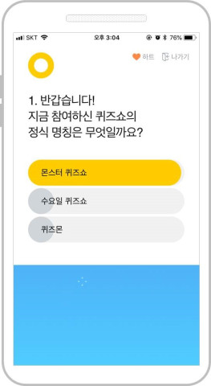
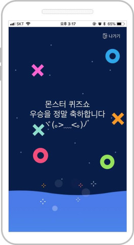

# 표준화 랩 채용 안내

티몬 표준화 랩에서 개발자 및 QA를 채용하고 있습니다.

## 표준화 랩 소개

표준화 랩은 TMON에서 Java 기반의 서비스를 구축하는 과정에서 Spring 기반의 Web Framework 지원과 배포 시스템 지원을 위해 생긴 작은 조직에서 시작되었습니다. Micro Service Architecture 기반의 서비스 환경을 구축하고 있으며 보다 다양한 서비스 경험을 고객에게 제공할 수 있도록 고민하고 있습니다.

### 주요 업무

- 빌드 배포 시스템 개발
- 빌드 배포 프로세스 수립(With QA)
- Spring 기반의 Framework 개발
- 서비스 모니터링
- 서비스 UI 개발
- 공통 API 
- 퀴즈쇼 & 출석체크 서비스

## 채용 중인 포지션

- Frontend 개발
- Backend 개발
- [QA](./qa.md)

## 지원 방법

[티몬 인재 채용](https://recruit.tmon.co.kr/recruit/list/001#page=1) 에서 지원해 주세요~!
