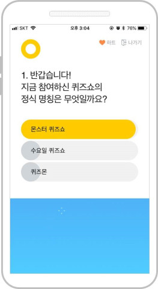
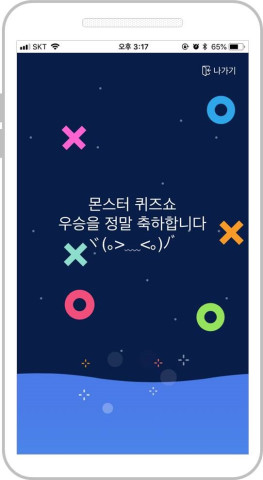

# QA 채용 안내

표준화 랩에서는 상반기에 출석체크 및 퀴즈쇼 등의 서비스를 신규로 론칭 하였고 품질 향상을 위해 QA를 채용하고 있습니다.

표준화 랩이 어떤 조직인지 궁금하다면 아래 링크를 읽어보세요.
[표준화 랩 채용 안내](https://github.com/tmoncorp/recruit)

## 주요 업무

### 퀴즈쇼 & 출석체크 서비스 QA

* 서비스 테스트 계획 수립 및 스프린트 관리
* 테스트 케이스 작성 및 테스트 수행
* 결함 관리 및 관리
* 서비스 배포

### 빌드 배포 플랫폼 및 프로세스

* Jenkins 배포 등록 및 관리
* 배포 프로세스 수립 및 유지 보수(with 개발자)

### 공통 영역 및 모듈 QA

* 공통 모듈 및 API 대한 테스트 및 결함 관리
* 공통 UI에 대한 UI 테스트 및 결함 관리

## 이런 분을 찾고 있습니다.

- 소프트웨어 테스트 및 QA에 대한 지식을 갖고 계신 분
- 웹 / 모바일 앱 환경의 서비스 QA에 익숙하고 흥미를 느끼시는 분
- 동료와 커뮤니케이션에 적극 적이신 분
- 자기 발전을 위해 꾸준히 노력하시는 분
- 변화와 도전을 즐기시는 분

## 채용하고자 하는 포지션

### 출석체크 & 퀴즈쇼 서비스 QA (1~3년 차)

- 웹서비스 혹은 앱 서비스 테스트 경험이 있으신 분
- 브라우저 혹은 OS 버전별 특성에 대해 이해하고 Test Case 작성이 가능하신 분
- 게임 혹은 커머스 서비스 경험하신 분

### 공통 API 및 모듈 QA(4~6년 차)

- 웹서비스 혹은 앱 서비스 테스트 경험이 있으신 분
- 브라우저 혹은 OS 버전별 특성에 대해 이해하고 Test Case 작성이 가능하신 분
- 게임 혹은 커머스 서비스 경험하신 분
- HTTP API 테스트 경험이 있으신 분(자체툴 or SOAP UI 등 플랫폼 이용)
- 성능 테스트 혹은 자동화 테스트를 경험하거나 관심 있으신 분
- Git 혹은 코드 형상관리에 대 이해하고 계신 분

## 이렇게 같이 성장할 수 있습니다.

다양한 기술적인 환경과 도전을 경험하실 수 있습니다. 표준화 랩은 티몬 서비스를 뒷받침 하기 위해 배포 시스템부터 오픈소스 거버넌스까지 다양한 업무를 시도하고 있습니다. 다양한 기술적인 도전과 함께 저희와 같이 성장하실 수 있는 분을 찾고 있습니다.

# 지원 방법

티몬 인재 채용 페이지에서 지원 하세요!
[티몬 인재 채용](https://recruit.tmon.co.kr/recruit/detail/001/146089)
